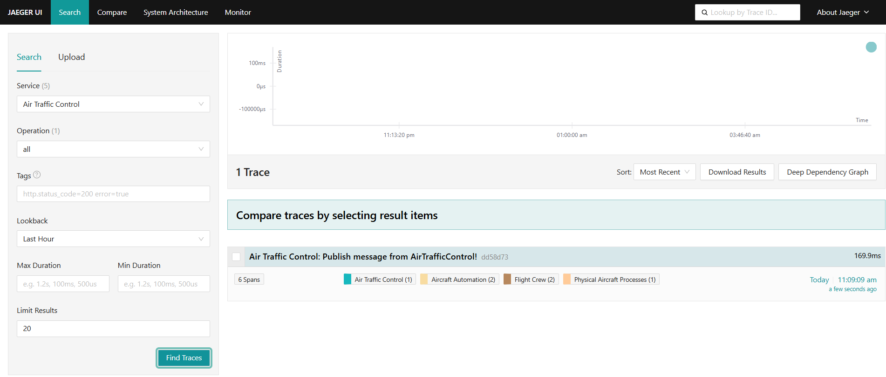
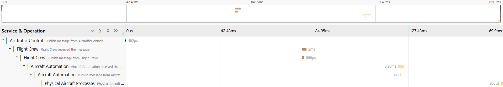
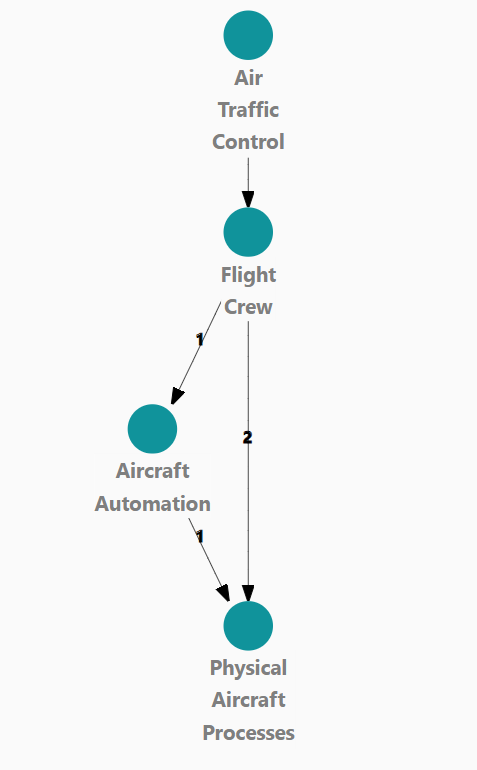
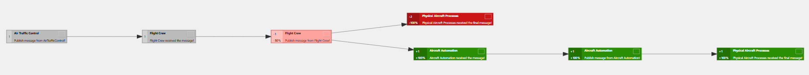

# AviationSystemSimulation
An MQTT project I made for my thesis, simulating the information flow and error propagation in a distributed system

## How to run this project:
This is an MQTT project, so there is no "main" class - each .py file can be run separately through a terminal in your idea.
To run a file, open a terminal and enter the command: 
### python "name of the file".py. 
For example: python ATC.py

Open more terminals to run all files at the same time and watch the information flow.

## Visual representation:
To understand better, what is happening - I set up the Jaeger UI, which monitors and shows the processes.
If you want to analyze visually - you need to download the Jaeger tracing tool from here(the "all-in-one" is the most important part, if you do not want to download the whole folder): 
https://www.jaegertracing.io/download/#binaries

After downloading it you should open a terminal and navigate to the location of the directory, which contains the "jaeger-all-in-one.exe" application, then give the command: 
### jaeger-all-in-one.exe
This will start the monitoring - so now from your browser you can open the Jaeger UI with the url:
### http://localhost:16686
The UI should look approximately like this: 

Press the "Find Traces" button, after running your files from the terminal, to catch them with Jaeger.
There are more views available - for example you can analyze the information flow, when running the classes.

You can also view the architecture of the system:

Or visualize graphs: 

The goal of the system is to forward instructions from the Air Traffic Control (ATC.py) class to the Physical Aircraft Processes of a plane(PAP.py). This is a distributed system - it works even without the automation class(AA.py), but if it is online, then the data goes through it.

Currently the ATC sends data every 3 seconds, which is a bit fast - but you can change it, if you want in the publish_message method, with the sleep() function.
